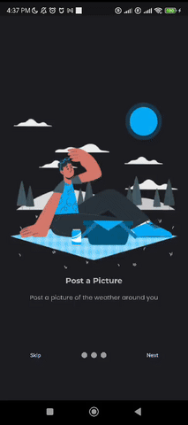

<p align="center"></p>
<h1 align="center"> Weathershare : Share the weather around you</h1>

<h3 align="center"><a href="https://weathershare.my.canva.site/">Download the app now</a></h3>

Weathershare is a crowdsourcing application that integrate weather station with traditional weather reports from many people to help verify weather forecasts. This application encourages the community to share weather conditions in their surrounding environment.

## Link to GitHub Repository

Weathershare - [https://github.com/satria-mitra/weathershare](https://github.com/satria-mitra/weathershare)

## Why bothers develop this app?

- Most weather forecast is accurate, but the real condition might be differ on the ground
- Many weather stations stand alone without combining their data with one another
- There is no solid platform to integrate chain of weather stations

## Benefits
- Crowdsourcing can significantly increase the number of data points available for weather prediction
- Crowdsourced data can offer real-time information on weather conditions, making it possible to track changes more quickly than with standard meteorological services. 

<p align="center"></p>


## Key Features
**:star2: Auto Pub Sub Indonesia Metorological Agency (BMKG) Weather Station:** Subscribe to Weather Station of BMKG and get realtime data.

**:zap: Use camera and share the real condition:** Share to other user of what is the real weather condition around you

**:fire: Direct Database Integration:** Integrated to Firebase as a secure datastore

**:iphone: Google Sign Up:** Hassle free and speed up registration form


## Screens
<p align="center"></p>

<table>
  <tr>
    <!-- Image 1 -->
    <td>
      <p align="center" style="font-size: 14px; font-weight: bold;">Google Sign Up</p>
      
      <br>
    </td>
    <!-- Image 2 -->
    <td>
      <p align="center" style="font-size: 14px; font-weight: bold;">Onboarding screen</p>
      
      <br>
    </td>
    <!-- Image 3 -->
    <td>
      <p align="center" style="font-size: 14px; font-weight: bold;">Google Maps with Marker</p>
      
      <br>
    </td>
  </tr>
</table>

<table>
  <tr>
    <!-- Image 1 -->
    <td>
      <p align="center" style="font-size: 14px; font-weight: bold;">Inspect weather station data</p>
      
      <br>
    </td>
    <!-- Image 2 -->
    <td>
      <p align="center" style="font-size: 14px; font-weight: bold;">Add more Weather Station</p>
      
      <br>
    </td>
    <!-- Image 3 -->
    <td>
      <p align="center" style="font-size: 14px; font-weight: bold;">Post an image</p>
      
      <br>
    </td>
  </tr>
</table>


## User Persona


This user persona is designed using [Xtensio](https://xtensio.com/).


## Mock-up Design

This is the mock-up design of each section of the page, visualising the user experience through the app's funcionality.


Designed on [mockup](https://getmockup.app/) app.


## Technologies behind this app
 - ✅ Flutter SDK
 - ✅ Firebase Firestore & Realtime Database
 - ✅ Google Functions
 - ✅ Google Maps API
 - ✅ BMKG MQTT Weather Station

## Databases
1. Firestore database
```
Firestore Database
|
|--- brokers (Collection)
     |
     |--- Document (ID: mqttName, String)
          |-- host: (String)
          |-- mqttname: (String)
          |-- password: (String)
          |-- port: (String)
          |-- username:(String)
```
```
Firestore Database
|
|--- devices (Collection)
     |
     |--- Document (ID: deviceID, String)
          |-- brokerRef: (reference)
          |-- deviceID: (String)
          |-- deviceName: (String)
          |-- latt: (String)
          |-- long:(String)
```
```
Firestore Database
|
|--- users (Collection)
     |
     |--- Document (ID: randomid, String)
          |-- Email: (reference)
          |-- Firstname: (String)
          |-- Lastname: (String)
```
2. Realtime Database Firebase
```
Realtime Database
|
|--- devices (Collection)
     |
     |--- Document (ID: deviceID, String)
          |-- date: (reference)
              |-- time: (String)
                  |-- rh_avg: (String)
                  |-- temp_avg: (String)

```
## Dependencies

  1. camera: ^0.10.5+9
  2. change_app_package_name: ^1.1.0
  3. cloud_firestore: ^4.16.1
  4. firebase_auth: ^4.19.1
  5. firebase_core: ^2.29.0
  6. firebase_database: ^10.5.2
  7. firebase_storage: ^11.7.1
  8. firebase_ui_auth: ^1.13.1
  9. flutter:
    sdk: flutter
10. flutter_native_splash: ^2.4.0
11. geolocator: ^11.0.0
  12. get: ^4.6.6
  13. get_storage: ^2.1.1
  14. google_fonts: ^6.2.0
  15. google_maps_flutter: ^2.2.8
  16. google_sign_in: ^6.2.1
  17. image_picker: ^1.1.0
  18. smooth_page_indicator: ^1.1.0
      
## Onboard Images
Illustration on this application is completely using copyright-free images from https://www.freepikcompany.com/.

## Development Environment

```
$ flutter --version
Flutter 3.19.5 • channel stable • https://github.com/flutter/flutter.git
Framework • revision 300451adae (4 weeks ago) • 2024-03-27 21:54:07 -0500
Engine • revision e76c956498
Tools • Dart 3.3.3 • DevTools 2.31.1
```

## Installation

Pre-requirements:

- Install Flutter and Dart
- Install simulation device or
- Have a phone plugged to the main machine
- Git clone this function
```
git clone https://github.com/satria-mitra/mqtt-node-app.git  
```

Run this repo
```
$ git clone https://github.com/satria-mitra/weathershare.git
$ cd weathershare
$ flutter pub get
$ flutter run
```

## Future Works
1. Add more brokers
2. Add more content to User Profile Screen
3. Implement heatmaps 

##  Contact Details

<p>Satria Mitra Utama </p>
<p>satriamitrautama@gmail.com </p>
Currently a student at Master of Connected Environment UCL


## Declaration of Authorship

I, Satria Mitra Utama, confirm that the work presented in this assessment is my own. Where information has been derived from other sources, I confirm that this has been indicated in the work.


Satria Mitra Utama

23 / 04 / 2024
